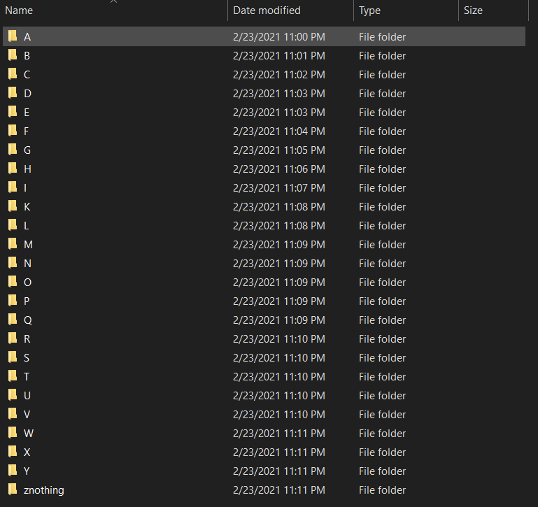

## Comandos

- py -3.10 -m venv .venv    si no funciona este comando instalar python 3.10
- .venv\Scripts\activate
- pip install numpy==1.26.0                                                                                    
- pip install opencv-python 
- pip install tensorflow
- pip install pandas matplotlib scikit-learn
- pip install pydot
- python -m pip install pyttsx3

## Dataset
(https://www.kaggle.com/ahmedkhanak1995/sign-language-gesture-images-dataset) 

Del dataset eliminar las carpetas de los numeros y eliminar la letra J y la letra z, ya que este tipo de letras requiere movimiento de las manos
de modo que quede de la siguiente manera:  

## Archivos

El archivo que ejecutamos primero es el training.py con el siguente comando  "python training.py"   
En este archivo esta el entrenamiento del modelo, actualizar las rutas del set de datos y actualizar la ruta donde se guardara el modelo.

El archivo main.py carga el modelo y es el que abre la camara para probarlo, actulizar las rutas del set y la ruta de donde guardaron el modelo.

El archivo imagen.py es para probar el modelo con una imagen especifica no es necesario ejecutarlo, lo cree solo para probar el modelo.

El mainV2 es una posible version en la que se usa una intefaz grafica con la libreria Tkinter tampoco es necesario correrlo.

